<!-- ===== HERO (custom SVG — assets/banner.svg) — dusk ridgeline, an equalizer rising off the peaks ===== -->


<div align="center">

### Endless music that never sounds the same twice.

A browser instrument that **composes calm, generative music live** — pick a genre, press play,
and a full arrangement writes itself: voiced chords, a developing melody, drums that reshape
bar to bar, on instruments drawn fresh for every take. A slow field of light drifts and pulses
along with it. No backend, no accounts, nothing to install.

<br/>

**TypeScript · React · Tone.js · Canvas 2D · Vite**

<br/>

[](https://jan-arn.github.io/nocturne/)
&nbsp;
&nbsp;

</div>

<br/>

## What it does

Press play and Nocturne generates music continuously — it never loops the same bar twice, but
it never sounds wrong either. Everything is composed on the fly and synthesized in the browser:

- **9 genres**, from beatless ambient drones to 174 BPM liquid drum & bass.
- **Instruments change every take.** Each voice is drawn from a pool of synthesis *archetypes* —
  Rhodes, Bell, Glass, Marimba, Saw Pad, Choir, Sub, Reece, Acid… — built from FM, AM and
  subtractive engines, so two takes rarely share a sound.
- **Generated structure.** Voiced chord progressions (with real voice-leading), a melodic theme
  that develops bar by bar, drum patterns pulled from per-genre banks, and whole-track
  arrangements assembled fresh — so the *shape* of a piece is never the same either.
- **A reactive visual** — a drifting gradient field that pulses on every kick, snare and note.

<sub><i>No samples, no loops — every sound is synthesized live with <a href="https://tonejs.github.io/">Tone.js</a>.</i></sub>

## Genres

| Genre | Tempo | Flavor |
|------|------|--------|
| **Lo-Fi** | 70–88 | Dusty keys, swung & warm |
| **Boom-Bap** | 86–96 | Hard-knock 90s hip-hop |
| **Trip-Hop** | 76–90 | Slow, dark, cinematic |
| **House** | 118–125 | Organic, Afro, sun-soaked |
| **Techno** | 124–132 | Hypnotic, deep, dub stabs |
| **Synthwave** | 98–116 | Neon arpeggios, chrome |
| **Dreamwave** | 88–104 | Washed, slow, weightless |
| **Liquid DnB** | 168–176 | Rolling breaks, deep sub |
| **Ambient** | 52–70 | Beatless, drifting drones |

## Controls

- **Shuffle** (`S`) — a fresh take of the current genre: new instruments, scale, key, tempo and structure.
- **Surprise** (`X`) — jump to a random genre and vibe.
- **Auto** — hands-free; drifts to fresh material every ~95s so you can leave it running for hours.
- **Genre** (`↑ ↓`) and **Vibe** (`← →`) — browse with the tabs or the arrow keys.
- **Macros** — Volume, Density (how busy), Space (how much reverb), live.
- **Shape** — Tempo, Swing, Key, and per-layer mutes (Drums / Chords / Bass / Lead).
- The **now-playing** panel shows the genre, key, scale, tempo and the three instruments this take drew.

`Space` plays and pauses.

## How it works

The composition engine lives in [`src/audio`](src/audio):

- **`patches.ts`** — synthesis engines (FM / AM / subtractive) and named instrument archetypes.
- **`genres.ts`** — each genre as data: a *groove*, tempo range, scale pool, harmony profile,
  percussion and instrument pools.
- **`sequencer.ts`** — dispatches rhythm on the groove (`beats` / `four` / `arp` / `breaks` / `ambient`).
- **`composer.ts`** — voice-led harmony, a developing melodic motif, and procedural arrangements.

Melody snaps to chord tones on strong beats and roams the scale in between, so the randomness
always lands musically — consonant by construction, but never repeating.

## Run locally

```bash
npm install
npm run dev
```

Then open the printed `http://localhost:5173/nocturne/` URL. Headphones help.

```bash
npm run build     # type-check + production build into dist/
npm run preview   # preview the production build
```

## Deploy

A GitHub Actions workflow ([`.github/workflows/deploy.yml`](.github/workflows/deploy.yml)) builds
the site and publishes it to GitHub Pages on every push to `main`.

1. Push this repo to GitHub.
2. In **Settings → Pages**, set the source to **GitHub Actions**.
3. Push to `main` — the site goes live at `https://jan-arn.github.io/nocturne/`.

The base path is `/nocturne/` (see [`vite.config.ts`](vite.config.ts)). To host under a different
path, set `VITE_BASE` at build time, e.g. `VITE_BASE=/my-path/ npm run build`.

## License

[MIT](LICENSE) © Jan Arnemann

<!-- ===== FOOTER (custom SVG — assets/footer.svg) — the ridgeline at night, the music still playing ===== -->

